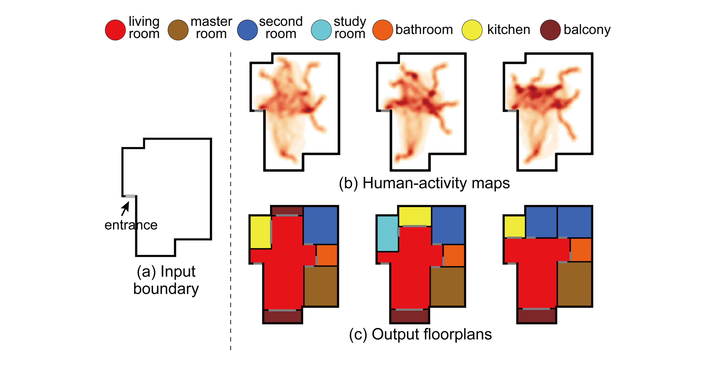

## [ActFloor-GAN: Activity-Guided Adversarial Networks for Human-Centric Floorplan Design](https://arxiv.org/pdf/2111.03545)

**Shidong Wang**, Wei Zeng*, Xi Chen, Yu Ye, Yu Qiao, and Chi-Wing Fu
IEEE Transactions on Visualization and Computer Graphics, 29(3): 1610-1624, 2023. (**TVCG**)

## Getting Started

### Configuration
* Python 3.7.13
* Pytorch 1.12.1
* NumPy 1.21.5

### Dataset

* (Optional) Download the RPLAN dataset from [here](http://staff.ustc.edu.cn/~fuxm/projects/DeepLayout/index.html) and place it in the folder `\Dataset\dataset_rplan`. Then, run `python 1.genActivityMap.py` to generate the dataset with human-activity maps in the folder `\Dataset\dataset_4c`. Each data in the dataset is a four-channel raster image, sequentially consisting of a boundary mask, category mask, human-activity map, and inside mask. The boundary mask, category mask, and inside mask are sourced from the RPLAN dataset.
* The dataset used in this paper can also be downloaded from [here](https://drive.google.com/file/d/1tCtRZ92RFmX3YR-Y1Wky71QIOmIC7jz0/view?usp=sharing). After downloading, place the dataset in the folder `\Dataset\dataset_4c`.
* (Optional) Run `python 2.dataset_split.py` to randomly split the dataset.

### Training

* We provide two training scripts: `MapGAN\train.py` and `ActFloorGAN\train.py` that you can find in the corresponding folders. For example:
```
  cd MapGAN
  python train.py
```

* The trained model can be download [here](https://drive.google.com/file/d/1Pk002-MS7pwBC4wNCgZfkZNGlyYj1DCQ/view?usp=drive_link) for test.

### Synth Floorplans

* Move the trained models into the folder `Synth/trained_model`.
* Navigate to `/Synth`, and run `python 1.genRasterLayout.py`. The output floorplan is stored in the folder `Synth/genRasterLayout`.
* Run `python 2.postProcessing.py`, and the well-annotated floorplan will be stored in the folder `Synth/normalization`.

### Visualization

* Use the vis tool developed by [RPLAN](http://staff.ustc.edu.cn/~fuxm/projects/DeepLayout/index.html) in the folder `Visualization/vis` to convert the floorplans in the folder `Synth/normalization` into vector txt files, and place them in the folder `Visualization/inputFPs`.
* Run `python visualization.py`, and then you can obtain the rasterized color floorplans in folder `Visualization/outputFPs`.

### Acknowledgement
* Original RPLAN dataset: http://staff.ustc.edu.cn/~fuxm/projects/DeepLayout/index.html

### Citation (Bibtex)
Please cite our paper if you find it useful:

``` 
@ARTICLE{wang2023actfloorgan,
  author={Wang, Shidong and Zeng, Wei and Chen, Xi and Ye, Yu and Qiao, Yu and Fu, Chi-Wing},
  journal={IEEE Transactions on Visualization and Computer Graphics}, 
  title={ActFloor-GAN: Activity-Guided Adversarial Networks for Human-Centric Floorplan Design}, 
  year={2023},
  volume={29},
  number={3},
  pages={1610-1624},
  doi={10.1109/TVCG.2021.3126478}
  }
``` 
